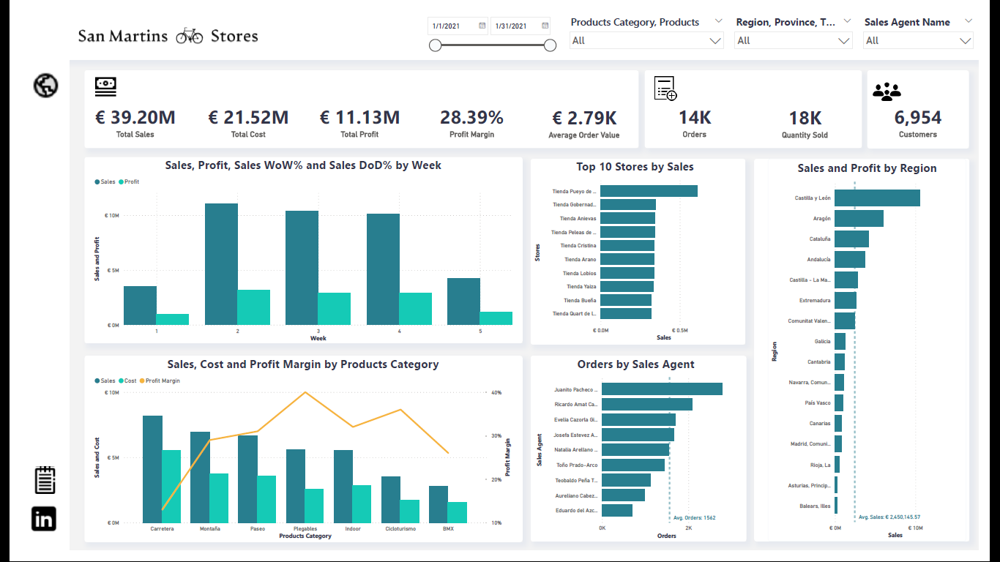
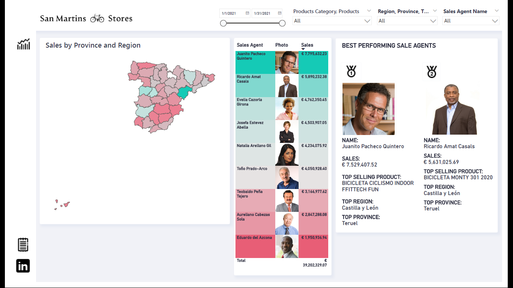

# San Martin Store Dashboard
This is a submission for [FP20 Analytics Challenge](https://www.linkedin.com/feed/update/urn:li:activity:7018113830710833153?utm_source=share&utm_medium=member_desktop).

This project is an analysis of the sales performance of the chain of San Martins Stores in Spain in January 2021. The data was analyzed using Power BI. The goal of this project was to gain insights into the sales and customer behavior of the company, identify areas of success and opportunities for improvement, and make recommendations for future action. I was able to quickly and easily explore and analyze the data, uncover key trends and patterns, and present the findings in an intuitive and user-friendly format. This project serves as a valuable tool for decision-making and strategic planning for the company.

Link to the [Dashboard](https://app.powerbi.com/view?r=eyJrIjoiY2UzMThjYjEtYjA3MS00NWY0LWI0MjItZDVjODExODEwODdmIiwidCI6ImRmODY3OWNkLWE4MGUtNDVkOC05OWFjLWM4M2VkN2ZmOTVhMCJ9&pageName=ReportSection)

Link to the [Executive Summary](https://github.com/Mevhare/San-Martin-Store-Dashboard/blob/main/Executive%20Summary.ipynb)

Screenshots of the dashboard;
 

